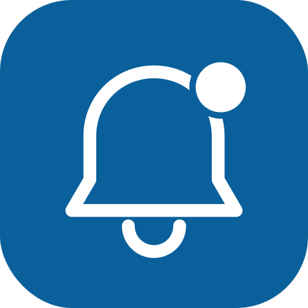

<div align="center">



# Notifins

**Web push notifications, made stupidly simple.**

Subscribe a browser in one click. Fire a notification from a single API call. No native app, no third-party SDK bloat — just the Web Push standard, done right.

[](https://noty-kappa.vercel.app/)


[**Live App**](https://noty-kappa.vercel.app/) · [Getting Started](#-getting-started) · [How It Works](#-how-it-works) · [API](#-api-reference)

</div>

---

## Overview

Notifins is a full-stack web push notification platform built on Next.js. It handles the entire lifecycle of a browser push notification — permission requests, subscription storage, and delivery — behind a clean UI and a small REST surface, so you can send real push notifications to a subscribed browser without writing any of the underlying Web Push plumbing yourself.

## ✨ Features

- 🔔 **One-click subscribe** — registers a service worker and requests notification permission with a single button
- 🔐 **Authenticated accounts** — sign-in and sign-up powered by [Kinde](https://kinde.com/)
- 📡 **VAPID-based Web Push** — standards-compliant push delivery via the `web-push` protocol, no third-party push provider required
- 🗄️ **Persistent subscriptions** — endpoints, keys, and user relationships stored in Postgres via Prisma
- 🌓 **Light/dark theming** — built with `next-themes` and a fully custom UI kit
- ⚡ **Optimistic, toast-driven UX** — subscription and send states are handled with TanStack Query + Sonner toasts
- 🖱️ **Click-through notifications** — clicking a delivered notification focuses (or opens) the right app tab
- 🧩 **Composable API route** — send a notification to any stored subscription with one `POST` request

## 🧱 Tech Stack

| Layer | Technology |
|---|---|
| Framework | [Next.js 16](https://nextjs.org/) (App Router) + [React 19](https://react.dev/) |
| Language | TypeScript |
| Styling / UI | Tailwind CSS 4, Radix UI, shadcn, Motion |
| Auth | Kinde (`@kinde-oss/kinde-auth-nextjs`) |
| Database / ORM | PostgreSQL + Prisma 7 (Neon adapter) |
| Push delivery | `web-push` (VAPID) + native Service Worker Push API |
| Data fetching | TanStack Query (React Query) |
| Deployment | Vercel |

## 🖥️ How It Works

```
┌────────────┐     1. register + subscribe      ┌──────────────────┐
│   Browser  │ ───────────────────────────────► │  Service Worker  │
│  (client)  │                                  │  (public/sw.js)  │
└─────┬──────┘                                  └──────────────────┘
      │ 2. save subscription (endpoint, p256dh, auth)
      ▼
┌────────────────────┐   3. POST /api/notification/send   ┌────────────────┐
│  Notifins backend   │ ◄─────────────────────────────────│   Any client   │
│  (Next.js API route)│                                   │  or trigger    │
└─────────┬───────────┘                                   └────────────────┘
          │ 4. webpush.sendNotification()
          ▼
┌────────────────────┐
│  Push service       │  (FCM / Mozilla / etc., chosen by the browser)
└─────────┬───────────┘
          │ 5. push event
          ▼
┌────────────────────┐
│  Service Worker    │  → shows the notification, handles click → focus/open tab
└────────────────────┘
```

1. The browser registers `public/sw.js` as its service worker and asks the user for notification permission.
2. On approval, the browser generates a `PushSubscription` (endpoint + encryption keys), which is persisted to Postgres and linked to the signed-in user.
3. Any authorized request to `/api/notification/send` triggers delivery to a stored subscription.
4. The server signs the payload with the app's VAPID keys and hands it to the browser's push service.
5. The service worker receives the `push` event, renders the notification, and routes the click back into the app.

## 🚀 Getting Started

### Prerequisites

- Node.js 18+
- pnpm (this project uses `pnpm-lock.yaml`)
- A PostgreSQL database (e.g. [Neon](https://neon.tech/))
- A [Kinde](https://kinde.com/) account for authentication

### 1. Clone & install

```bash
git clone https://github.com/<your-username>/noty.git
cd noty
pnpm install
```

### 2. Configure environment variables

Create a `.env` file in the project root:

```bash
# Database
DATABASE_URL=

# Kinde Auth
KINDE_CLIENT_ID=
KINDE_CLIENT_SECRET=
KINDE_ISSUER_URL=
KINDE_SITE_URL=
KINDE_POST_LOGOUT_REDIRECT_URL=
KINDE_POST_LOGIN_REDIRECT_URL=

# VAPID keys (for Web Push)
NEXT_PUBLIC_VAPID_PUBLIC_KEY=
PRIVATE_KEY=
```

Generate a VAPID key pair with:

```bash
npx web-push generate-vapid-keys
```

### 3. Set up the database

```bash
npx prisma migrate dev
```

### 4. Run the dev server

```bash
pnpm dev
```

Open [http://localhost:3000](http://localhost:3000) — you'll be redirected to sign in, then dropped into the subscribe/send flow.

## 📡 API Reference

### `POST /api/notification/send`

Sends a push notification to a given subscription endpoint.

**Body**

```json
{
  "title": "Salaan",
  "body": "Assalaamu calaykum, seetahay saaxiib?",
  "url": "/",
  "endpoint": "https://fcm.googleapis.com/fcm/send/..."
}
```

**Response**

```json
{
  "success": true,
  "message": "notifications sent!"
}
```

If the endpoint isn't associated with any stored subscription, the API returns a `404` with an explanatory error message.

## 🗂️ Project Structure

```
noty/
├── actions/                # Server actions (subscription + user)
├── app/
│   ├── api/
│   │   ├── auth/[kindeAuth]/     # Kinde auth handler
│   │   ├── notification/send/    # Push delivery endpoint
│   │   └── user/create/          # User provisioning
│   ├── dashboard/           # Dashboard route
│   ├── login/                # Sign in / sign up
│   └── page.tsx              # Subscribe + send demo UI
├── components/               # UI components (shadcn/ui based)
├── lib/                      # Prisma client, web-push client, helpers
├── prisma/                   # Schema + migrations
└── public/
    └── sw.js                 # Service worker (push + click handling)
```

## 📄 License

Released under the MIT License.

---

<div align="center">
Built by <strong>Abubakar Dahir Hassan</strong> — try it live at <a href="https://noty-kappa.vercel.app/">noty</a>
</div>